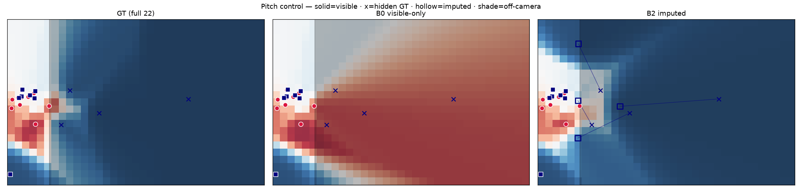
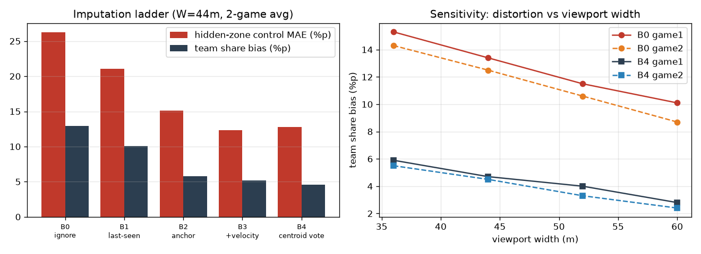

# Off-Screen Player Imputation for Broadcast-Based Spatial Football Analytics

Training-free, online imputation of off-camera players, benchmarked by what actually
matters downstream: **pitch-control error and team control-share error**, not just
trajectory fidelity.

Broadcast cameras show only 10–16 of 22 players. Computing spatial metrics on the
visible subset silently hands the hidden half of the pitch to the wrong team:


*Left: ground-truth pitch control with all 22 players. Middle: visible-only (the
baseline implied whenever a GSR pipeline adds no imputation layer) — the hidden
defenders vanish and the right half flips. Right: imputed.*

## Results (Metrica open data, simulated 44 m broadcast viewport, 3 matches)

The table shows all three games (g1 / g2 / g3); game 3 — a held-out half in Metrica's
EPTS-FIFA format, parsed by a separate loader — was frozen before evaluation and used
as a held-out check of the method ladder. The script also reports ablations B3e (EMA
offsets only), B3v (velocity blend only) and B5 (fixed formation template =
cumulative-mean offsets), plus B4 fallback-source shares and 1-minute block-bootstrap
95% CIs for B0/B4.

| policy | hidden-zone control MAE (g1/g2/g3) | team share error (g1/g2/g3) | median position error (g1/g2/g3) |
|---|---|---|---|
| B0 ignore (no imputation) | 26.9 / 25.6 / 25.1 %p | 13.4 / 12.5 / 11.1 %p | — |
| B1 last-seen + decay | 22.1 / 20.0 / 19.5 | 10.6 / 9.5 / 8.2 | 19.6 / 17.9 / 18.4 m |
| B2 formation anchor | 15.7 / 14.6 / 14.3 | 6.2 / 5.4 / 4.4 | 13.6 / 12.8 / 12.5 m |
| B3 + velocity extrapolation | 12.8 / 11.8 / 13.2 | 5.7 / 4.6 / 4.7 | 14.6 / 14.0 / 15.1 m |
| **B4 centroid voting** | **13.3 / 12.2 / 13.8** | **4.7 / 4.5 / 4.7** | **11.6 / 10.0 / 9.7 m** |

**B4 (the interesting one):** each visible player votes for the full-team centroid as
*(position − running role offset)*; the voted centroid replaces the viewport-biased
visible mean both for storing offsets and for imputing. No training data, no future
observations, real-time on CPU. It roughly halves hidden-zone control error versus
ignore and cuts control-share error to 28–48% of it across viewport widths 36–60 m,
with the lowest position error in all three games. In the short-occlusion regime
(≤9.6 s) covered by learned imputers (e.g. Graph Imputer, trained on 105 proprietary
matches with bidirectional context), B4 reaches 3.3–8.9 m median error — while 50–57%
of hidden-player observations lie beyond that regime, outside the 9.6 s sequence
protocol of the closest prior work.



## Reproduce (CPU-only, ~2 min per run)

```bash
pip install -r requirements.txt
bash scripts/download_data.sh
python src/impute_bench.py --game 1 --width 44 --fps 5 --minutes 45
python src/impute_bench.py --game 2 --width 44 --fps 5 --minutes 45
python src/impute_bench.py --game 3 --width 44 --fps 5 --minutes 45  # held-out EPTS half
# snapshot figure:
python src/impute_bench.py --game 1 --minutes 20 --viz 2500
```

Every benchmark number in the paper comes from these commands. Total compute cost: $0.
(The real-broadcast case study uses World Cup footage that cannot be redistributed; the
pipeline code is open but the footage must be sourced separately.)

## Paper

Full text: [`paper/offscreen_impute_EN.md`](paper/offscreen_impute_EN.md)
(Korean version: [`paper/offscreen_impute_KO.md`](paper/offscreen_impute_KO.md)).
LaTeX source: [`paper/latex/main.tex`](paper/latex/main.tex).

## Data & license

- Code: MIT.
- Tracking data: [Metrica Sports sample data](https://github.com/metrica-sports/sample-data),
  fetched by the download script, **not redistributed here** — see their repository for terms.
